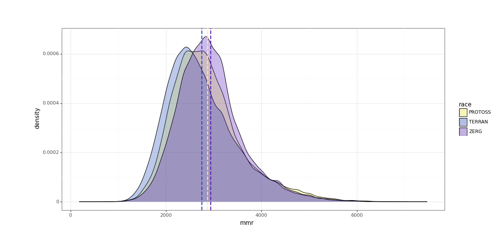

# Starcraft 2: Player and matches data analysis

## Motivation

## Data collection
We want to collect player and match data of all players in the current ladder season. Activition Blizzard has player profile data and match history data stored on their servers. We are able to access those raw data using the [Blizzard Battle.net API](https://develop.battle.net/documentation/starcraft-2/community-apis) as our data source. 

### Using the API
In their API, Blizzard provides a variety of metadata such as player achievements and in-game rewards. We want to access specifically the data on player performance (e.g. Wins/losses, matchmaking rating, rank) as well as their match history. 

The data we want comes from a variety of API endpoints. Some important ones are the `legacy/getLeagueData` endpoint, `/Ladder` endpoint, as well as the `/getmatchhistory` endpoint.

The figure above shows the basic structure of the Battle.net API endpoints for Starcraft II. To begin, we make a request to the `legacy/getLeagueData` endpoint which returns the `ladderid` of all active ladders in the current season. Then we make a request to the `ladder` endpoint using `ladderid` to obtain the list of `playerid` within the ladder. In the end, `playerid` is used to request the player's profile and their match history.

We used a object-oriented approach to make API requests, defining `player` and `ladder` classes and corresponding methods in fetching data. 

One issue that arises during data collection is the managing complexity of interactions between API endpoints. Due to the immense amount of raw data generated in the game, Blizzard had to store player level data in different endpoints. For instance, the `/profile/ladder` endpoint stores all performance data of players in a ladder (a mini-league uniquely identified by a `ladderid` that contains 100 players of the same level). However, to access the `/profile/ladder` endpoint, one must specify the `ladderid` as well as `playerid` in the API call, as the request is made at the player level.

## Exploratory Analysis

Using API requests we are able to gather data on ~200,000 individual player profiles and ~5,000,000 matches. Note that since games are being played everyday and players are constantly joining/leaving the ladder, the number will vary slightly each time data is updated.

### Player level data example (not real data)

|Playerid|Name|Realm|Region|Rating|League|Wins|Losses|Race|
|--------|----|-----|------|------|------|----|------|----|
|1074576|SRHarstem|1|2|6700|Grandmaster|10|2|Protoss|
|2754199|Alucard|1|1|3454|Diamond 3|102|110|Terran|
|114514|Billy|1|2|2870|Platinum 2|45|40|Protoss|
|1919810|Van|1|3|5436|Masters 1|34|25|Zerg|

### Summary Statistics

### Match level data example (not real data)

|Playerid|Name|Realm|Region|Race|Map|Type|Result|Speed|Date|
|--------|----|-----|------|----|--|------|----|------|----|
|1074576|SRHarstem|1|2|Protoss|Babylon|1v1|Win|faster|1675124962|
|1074576|TLSkillous|1|2|Protoss|Altitude|1v1|Win|faster|1669691322|
|1074576|EnceSerral|1|1|Zerg|Data-C|1v1|Win|faster|1671114514|
|1074576|OnsydeMaru|1|3|Terran|Moondance|1v1|Loss|faster|1675106898|

## Is the game well-balanced in its mechanics? 

Another question of interest is "Is the game well balanced in its mechanics? " In this case, game balance refers to the situation where there doesn't exist a dominant race that outperforms the rest because it's easier to play that race or it's uplifted and become stronger.

### ** MMR (Matchmaking rating) distribution by in-game race:**
   

This figure gives an overall picture of the MMR distribution of each race. Higher values of MMR tend to correspond to better performances. In Figure 1, the blue, yellow, and purple dotted lines show the mean values of MMR of TERRAN, PROTOSS, and ZERG respectively. This means that on average, ZERG players tend to have the best performance among the three races, and TERRAN is likely to be the one that underperforms. However, there are several problems with using MMR value as an indication of performance and skill. For instance, there exist some smurfs who specifically create or buy low-level accounts to play against lower-ranked players. In this case, their MMR would underestimate their performance and skill level. Moreover, MMR value could also be manipulated via hacking. As a result, it would be more appropriate to use win rate as an indicator of performance. 
###  **Race-wise win rates by league**
   

This figure shows the win rate of each league by race. As the Figure illustrates, the win rate increases as the league goes up in general. The only exception is the sudden drop in the win rate of PROTOSS in Masters 3 and Masters 2 leagues. The win rates of three races overlap in the lower leagues, Bronze 1 and Silver 3, and middle-upper leagues Platinum 2 and Platinum 1. TERRAN tends to outperform the rest in the upper leagues from Diamond 2 to Grandmaster. This little heterogeneity makes us wonder: when playing against each other, is there one race that particularly outperforms the other? 

###  **Matchup-wise win rates by league**

As shown by the figure above, it turned out that in lower-level leagues, from Bronze 3 to Gold 2, ZERG significantly outperforms TERRAN, and the situation is similar for PROTOSS except for Bronze 3. However, when it comes to the upper leagues, ZERG players generally underperform when they play against the other races, except for the case where ZERG plays against PROTOSS in Masters 2 league. It is also worth noting that in the upper leagues from Diamond 2 to Grandmaster, when playing against each other, TERRAN tends to win more often than PROTOSS, which is consistent to what's shown by the previous figure. 

theme: hacker
