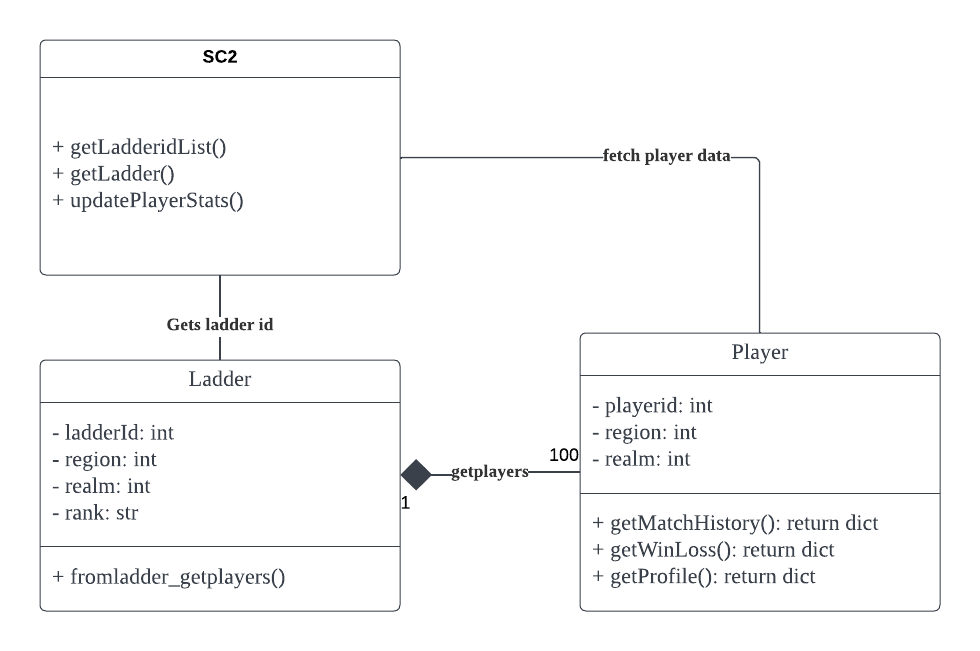
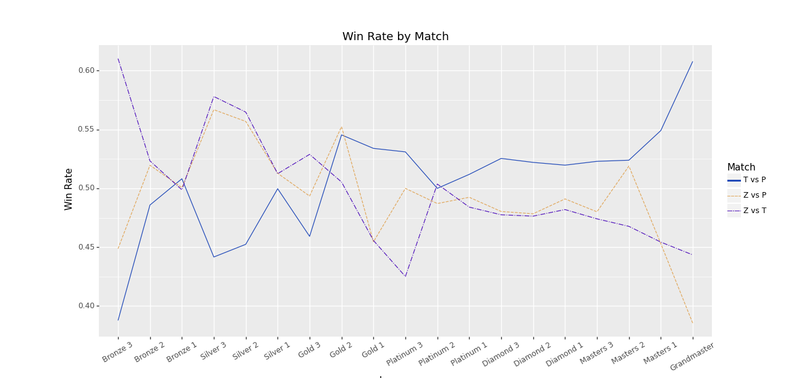
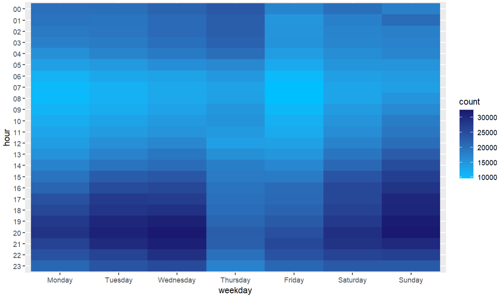

# Starcraft 2: Player and matches data analysis

## Motivation

## Data collection
We want to collect player and match data of all players in the current ladder season. Activition Blizzard has player profile data and match history data stored on their servers. We are able to access those raw data using the [Blizzard Battle.net API](https://develop.battle.net/documentation/starcraft-2/community-apis) as our data source. 

### Using the API
In their API, Blizzard provides a variety of metadata such as player achievements and in-game rewards. We want to access specifically the data on player performance (e.g. Wins/losses, matchmaking rating, rank) as well as their match history. 

The data we want comes from a variety of API endpoints. Some important ones are the `legacy/getLeagueData` endpoint, `/Ladder` endpoint, as well as the `/getmatchhistory` endpoint.


The figure above shows the basic structure of the Battle.net API endpoints for Starcraft II. Note that unlike on the figure, going down each branch in the data results in increase in data entries by an order of magnitude of considerable larger. To begin, we make a request to the `legacy/getLeagueData` endpoint which returns the `ladderid` of all active ladders in the current season. This should give about 2000 unique `ladderid`, which each contain around 100 players.  Then we make a request to the `ladder` endpoint using `ladderid` to obtain the list of `playerid` within the ladder. By this point, we should be able to track the profile of around 200,000 players with all three servers (US, EU, and KR) combined. In the end, a player's `playerid` is used to request the player's profile and their match history. The `matchhistory` endpoint stores the 25 most recent matches of a player regardless of when the matches were played. The resulting data should consist of around 5,000,000 matches for 200,000 players.

### Facing the API side problems

An obvious issue that arises is the complications that come with making tremendous amounts of API calls in our code. One factor that feed into this issue is the request quota, where single clients were able to make up at most 36,000 API requests per hour. (which is more generous than most other API providers) This results in at least $\frac{200000}{36000}=5.33$ hours of runtime to fetch the match data. The code becomes a nightmare to debug, since if the exceptions were not carefully considered, one `IndexError` caused by missing values on the serverside may result in the termination of the script.

Another issue that arises during data collection is the managing complexity of interactions between API endpoints. Due to the immense amount of raw data generated in the game, Blizzard had to store player level data in different endpoints. For instance, the `/profile/ladder` endpoint stores all performance data of players in a ladder (a mini-league uniquely identified by a `ladderid` that contains 100 players of the same level). However, to access the `/profile/ladder` endpoint, one must specify the `ladderid` as well as `playerid` in the API call, as the request is made at the player level.

### Making things less messy: OOP approach

We used a object-oriented approach to make API requests, defining `player` and `ladder` classes and corresponding `getmatchhistory` and `getplayers` methods in fetching data. This way, each `player` and `ladder` will have corresponding methods for different available API requests with unique URLs, and looping through those objects and calling the API request methods will yeild an list of dictionaries which can then then be converted to our dataframe. Here is a simple UML class diagram for class structure used:



## Using databases to store and update data

```Python
import pandas as pd
from sqlalchemy import create_engine
from SC2 import APIkey

hostname=APIkey.dbhostname
dbname=APIkey.dbname
uname=APIkey.dbusername
pwd=APIkey.password

#Establish connection with mySQL server
engine = create_engine("mysql+pymysql://{user}:{pw}@{host}/{db}"
				.format(host=hostname, db=dbname, user=uname, pw=pwd))
#Read saved raw data from the server
players_df=pd.read_sql('SELECT * FROM players', engine)

...

#Save processed dataframe as new table
players_df.to_sql('processedplayers', engine, if_exists='replace', index=False)
```

### Data Cleaning

The raw API contains bugged data points that would affect the outcome of the analysis. For example, duplicate player data may skew the results; abserd MMR scores are simply invalid and do not add value to the analysis; league labels do not necessarily match the MMR scores.

Steps to clean the data include:
-Dropping duplicate players (using .drop_duplicates())
-Dropping players with unknown wins and losses
-Dropping players with absert MMR scores
-Converting wins and losses to integers
-Fixing league allocations based on league-MMR boundaries obtained from the API

As a clarification, leagues are based on MMR, and each league as a corresponding MMR range that does not overlap with other leagues. 

To obtain the boundaries, we collected the 'min_rating' for each league tier on all servers. getboundaries() returns a list of 3 lists of boundaries for each league tier on each server. 

```Python
    #getting boundaries from the Battle.net API. The function returns 18 mmr values for the mmr floor for each range. 
    def getboundaries(season, region):
        #Creating emtpy list to store all boundaries in this server
        boundarieslist=[]
        #Looping from Bronze(0) to Masters(5)
        for i in range(6):
            #Generating URL
            url = ('https://'+ 
                str(APIkey.region_idr[region]) +
                '.api.blizzard.com/data/sc2/league/' +
                str(season) +
                '/201/0/'+str(i))
            #Creating requests session
            league_response=requests.get(url, params=APIkey.token)
            #Checking if response is 200 OK
            if league_response.status_code==200:
                #Pring url to show that request was successful
                print(url)
                tier=league_response.json()['tier']
                #Extracting mmr floor of each tier
                thisleague_tiers=[tier[2]['min_rating'], tier[1]['min_rating'], tier[0]['min_rating']]
                boundarieslist=boundarieslist+thisleague_tiers
            else:
                print('error retrieving boundaries for leauge ' + str(i))
                print(league_response)
        if (region==1 or region==2):
            boundarieslist[0]=1045
            boundarieslist[1]=1283
            boundarieslist[2]=1522
        return boundarieslist
```
Note that, as the API is slightly bugged, not all league-MMR boundaries are accurate, and we had to rely on arbitrary boundaries based on https://burnysc2.github.io/MMR-Ranges/. Also, grandmasters league is not bugged and does not need to be fixed. Any grandmaster player shall remain as grandmaster in the players dataframe.


Additionally, we added columns "Total Games" (given by wins+losses) and "Win Rate" (given by wins/totalgames) as they would prove useful in the analysis below.

## Exploratory analysis on fetched data

Using API requests we are able to gather data on ~200,000 individual player profiles and ~5,000,000 matches. Note that since games are being played everyday and players are constantly joining/leaving the ladder, the number will vary slightly each time data is updated.

### Player level data example (not real data)

|Playerid|Name|Realm|Region|Rating|League|Wins|Losses|Race|
|--------|----|-----|------|------|------|----|------|----|
|1074576|SRHarstem|1|2|6700|Grandmaster|10|2|Protoss|
|2754199|Alucard|1|1|3454|Diamond 3|102|110|Terran|
|114514|Billy|1|2|2870|Platinum 2|45|40|Protoss|
|1919810|Van|1|3|5436|Masters 1|34|25|Zerg|

### Summary Statistics

### Match level data example (not real data)

|Playerid|Name|Realm|Region|Race|Map|Type|Result|Speed|Date|
|--------|----|-----|------|----|--|------|----|------|----|
|1074576|SRHarstem|1|2|Protoss|Babylon|1v1|Win|faster|1675124962|
|1074576|TLSkillous|1|2|Protoss|Altitude|1v1|Win|faster|1669691322|
|1074576|EnceSerral|1|1|Zerg|Data-C|1v1|Win|faster|1671114514|
|1074576|OnsydeMaru|1|3|Terran|Moondance|1v1|Loss|faster|1675106898|


## Is the game well-balanced in its mechanics? 

Another question of interest is "Is the game well balanced in its mechanics? " In this case, game balance refers to the situation where there doesn't exist a dominant race that outperforms the rest because it's easier to play that race or it's uplifted and become stronger.

### **<br>MMR (Matchmaking rating) distribution by in-game race:**
<br>  


This figure gives an overall picture of the MMR distribution of each race. Higher values of MMR tend to correspond to better performances. In Figure 1, the blue, yellow, and purple dotted lines show the mean values of MMR of TERRAN, PROTOSS, and ZERG respectively. This means that on average, ZERG players tend to have the best performance among the three races, and TERRAN is likely to be the one that underperforms. However, there are several problems with using MMR value as an indication of performance and skill. For instance, there exist some smurfs who specifically create or buy low-level accounts to play against lower-ranked players. In this case, their MMR would underestimate their performance and skill level. Moreover, MMR value could also be manipulated via hacking. As a result, it would be more appropriate to use win rate as an indicator of performance. 
### <br>**Race-wise win rates by league**
<br>  


This figure shows the win rate of each league by race. As the Figure illustrates, the win rate increases as the league goes up in general. The only exception is the sudden drop in the win rate of PROTOSS in Masters 3 and Masters 2 leagues. The win rates of three races overlap in the lower leagues, Bronze 1 and Silver 3, and middle-upper leagues Platinum 2 and Platinum 1. TERRAN tends to outperform the rest in the upper leagues from Diamond 2 to Grandmaster. This little heterogeneity makes us wonder: when playing against each other, is there one race that particularly outperforms the other? 

### <br>**Matchup-wise win rates by league**




As shown by the figure above, it turned out that in lower-level leagues, from Bronze 3 to Gold 2, ZERG significantly outperforms TERRAN, and the situation is similar for PROTOSS except for Bronze 3. However, when it comes to the upper leagues, ZERG players generally underperform when they play against the other races, except for the case where ZERG plays against PROTOSS in Masters 2 league. It is also worth noting that in the upper leagues from Diamond 2 to Grandmaster, when playing against each other, TERRAN tends to win more often than PROTOSS, which is consistent to what's shown by the previous figure.


## What proportion of race A is in league B? 


As previously established, in Starcraft 2 we have three main races - TERRAN, PROTOSS, and ZERG. In some circumstances, players are also able to choose a ‘RANDOM’ race at the beginning of a match. In terms of leagues, the game boasts 16 different leagues with ‘Bronze 3’ being the lowest and ‘Grandmaster 1’ being the highest.

A main question we set out to investigate was whether the game is well balanced in its mechanics. Unlike before, this refers to the proportion of each race in each league. If we were to notice that a particular race tends to be placed in certain leagues more often than others, then it may be justified to question the balance of the game. 

The findings of this research could be used as an indicator for players;  in this sense, it may assist them when it comes to choosing which race to play.


### <br>**Utilising tidyverse on RStudio:**

The code below demonstrates how we used packages such as tidyverse to create this Proportional Stacked Area Graph.

Initially, we created a few data frames and decided to use the data frame with information on race and league for this exploration. To get the format required, we converted the data in both columns into factors and obtained the percentages for each race in each league. We put this into a new data frame called ‘main_final_table’.

Next, we created a new data frame called ‘main_final_table2’ where we simply removed all the unknown races from ‘main_final_table’ in order to devise a more accurate picture. After ordering the leagues from ‘Bronze 3’ to ‘Grandmaster 1’, and the races with ‘RANDOM’ on the highest stack and ‘TERRAN’ on the lowest, we created the Proportional Stacked Area Graph.

```{r}
#import files

library(rvest)
library(tidyverse)
library(dplyr)
library(ggplot2)
library(datasets)
library(reshape2)


#set working directory and load files 
setwd("~/DS105_Project")
table_main2_file <- read.csv("processedplayers.txt")

#creating different dataframes
table_mmr_race_league <- table_main2_file[, c("mmr","race", "league")]
table_mmr_race_region <- table_main2_file[, c("mmr","race", "region")]
table_race_league <- table_main2_file[, c("race", "league")]


#editing the format of the variables and creating a dataframe with the percentages

table_race_league$league <- as.factor(table_race_league$league)
table_race_league$race <- as.factor(table_race_league$race)
view(table_race_league)

main_table <- table_race_league %>% group_by(race, league) %>%
  tally()

main_final_table <- transform(main_table, percent = ave(n, league, FUN = prop.table))

#creating the Proportional Stacked Area Graph.

main_final_table2 <- main_final_table[!(main_final_table$race=="Unknown" |main_final_table$race=="unknown"),]

main_final_table2$league <- factor(main_final_table2$league , levels=c("Bronze 3", "Bronze 2", "Bronze 1", "Silver 3", "Silver 2", "Silver 1", "Gold 3", "Gold 2", "Gold 1", "Diamond 3", "Diamond 2", "Diamond 1", "Masters 3", "Masters 2", "Masters 1", "Grandmaster 1"))
main_final_table2$race <- factor(main_final_table2$race , levels=c("RANDOM", "ZERG", "PROTOSS", "TERRAN"))

final_graph_1 <- ggplot(main_final_table2, (aes(x = league,  y = percent, fill = race, group = race))) +
  geom_area(alpha=0.6 , linewidth=0.3, colour="black") +   scale_fill_manual(values=c('grey', '#5519BD', '#FFFF40', '#244CB9'))

#to view the graph
final_graph_1
```


### <br>**Proportional Stacked Area Graph - showing what races are the leagues composed of:**


This figure displays the proportion of each of the races in each of the leagues. From this, we can see that a bulk of the lower league players are TERRAN - they make up around 50% of the players in the Bronze leagues. Relatively, it is exceptionally harder to find PROTOSS or ZERG players in those lower leagues. This points to severe imbalance of the game when it comes to races in lower leagues. This finding may encourage new players to select races other than TERRAN if they want to maximise their chances of not competing in lower leagues. 

However, it is crucial to note that the distribution of races in the higher leagues (from Diamond 3) are more equal. Referring to the previous analysis presented on win-rates by race in different leagues, it is interesting to observe how the TERRAN race actually outperforms the other races in higher leagues.


## At what time of the day do people play the game?


Shifting to another aspect of gaming, a preconceived notion we held was that people played Starcraft 2 heavily on the weekends in comparison to weekdays. To understand this, we were determined to investigate the question “At what time of the day do people play the game?”.

We intend for these findings to serve as an instrument which players can use to strategize the best timings to play. For instance, upon discovering that most people play at 10pm, this may motivate some players to switch to this time in order to play in a larger pool.

### <br>**Utilising tidyverse and mutating data on RStudio:**

As we were concerned with only matches where players were against one other player, we filtered our data for only ‘1v1 matches. There are three regions in the game (USA/Korea/Europe) and we wanted to see the times players play Starcraft 2 globally. Hence, we mutated our data by combining the regions and made the time localised for each timezone. 

We then added new columns into the main data frame, which had the weekdays and the time. Then in our new data frame called ‘main_table_heatmap’, we had a column for the weekday and a new column for just the hour. We ordered weekdays from Monday-Sunday and our time where 00 is 12-am and 23 is 1-pm. Lastly, we created the density heatmap using ggplot (geom_bin2d()). 

```{r}
#import the packages

library(rvest)
library(tidyverse)
library(dplyr)
library(ggplot2)
library(datasets)
library(plotly)
library(lubridate)

#set working directory and load files 
setwd("~/DS105_Project")
matches_full <- read.csv("matchesdata.txt")

#Grpah - time heat map

matches_full_only_1v1 <- matches_full %>% filter(X7=="1v1")

main_dataframe_matches <- matches_full_only_1v1 %>% 
  mutate(new_timezone=if_else(X4 == 1, 
                              as.POSIXct(X10, origin="1970-01-01", timezone="America/New_York"), 
                              if_else(X4 == 2, 
                                      as.POSIXct(X10, origin="1970-01-01", tz="Europe/London"),
                                      as.POSIXct(X10, origin="1970-01-01", tz="KR time" ))   ))


#creating new coloumns (in 'main_dataframe_matches' dataframe) for day and hour

main_dataframe_matches$weekday <- weekdays(as.Date(main_dataframe_matches$new_timezone))

main_dataframe_matches$hour_min_sec <- substr(main_dataframe_matches$new_timezone, 12, 19)

main_table_heatmap <- data.frame(main_dataframe_matches$weekday, main_dataframe_matches$hour_min_sec, main_dataframe_matches$X4)

#making a new coloumn in the 'heatmap dataframe' with just the hour, and categorizing the hour and weekday coloumn

main_table_heatmap$hour <- hour(hms(main_table_heatmap$main_dataframe_matches.hour_min_sec))

hr_breaks = seq(0, 25, by = 1)
hr_labels <- c('00', '01', '02', '03', '04', '05', '06', '07', '08', '09',
               '10', '11', '12', '13', '14', '15', '16', '17', '18', '19',
               '20', '21', '22', '23', '24')

main_table_heatmap$ordered_time = cut(main_table_heatmap$hour, breaks = hr_breaks, 
                                      labels = hr_labels,
                                      include.lowest = T, right = F)


main_table_heatmap$ordered_time <- factor(main_table_heatmap$ordered_time,
                                          levels=c('24', '23', '22', '21', '20', '19', 
                                                   '18', '17', '16', '15',
                                                   '14', '13', '12', '11', '10', '09',
                                                   '08', '07', '06', '05',
                                                   '04', '03', '02', '01', '00'))


main_table_heatmap$main_dataframe_matches.weekday <- factor(main_table_heatmap$main_dataframe_matches.weekday,
                                                            levels=c('Monday', 'Tuesday', 'Wednesday', 'Thursday',
                                                                     'Friday', 'Saturday', 'Sunday'))

#final step is to create the Heatmap

final_graph_heatmap_main <- ggplot(data= main_table_heatmap, aes(main_dataframe_matches.weekday, ordered_time, frame = main_dataframe_matches.X4)) + geom_bin2d() +  xlab(label = "weekday") + ylab(label = "hour") +
  scale_fill_gradient(low = "deepskyblue", high = "midnightblue") 


#to view the graph

final_graph_heatmap_main 
```

### <br>**Heatmap displaying the frequency of games played - based on hour and weekday:**




This density heatmap provides us with a visual path to understand the timings people play. It also allows us to spot trends easily as it gives us an instant overview of the data.

Given time is localised for each timezone, this plot shows us the frequency of games played in all the regions based on the hour and weekday. The ‘count’ bar, to the right of the plot, explains how the darker tiles show higher frequency of games played, whereas the lighter tiles show lower frequency of games played.

This figure shows that people tend to play most on Sundays. Intuitively, this makes sense as it is a weekend and people tend to relax before the new week commences. However, noticing that people also play heavily on Wednesdays is striking - especially when you compare it to the days later in the week such as Fridays. Additionally, the heatmap shows us that people play more in the evenings. This was expected as people tend to relax in the evenings after attending to their daily commitments either at school or work.


## Group member roles

<center>

||Nigel|Zihe|Qing|Awo|
|----|-----|----|----|---|
|Data Collection|-|√|-|-|
|Data cleaning and <br>transformation|√|√|√|√|
|Data Visualization|√|-|√|√|
|Database maintanance|-|√|-|-|
|Documentation|√|-|√|√|

</center>